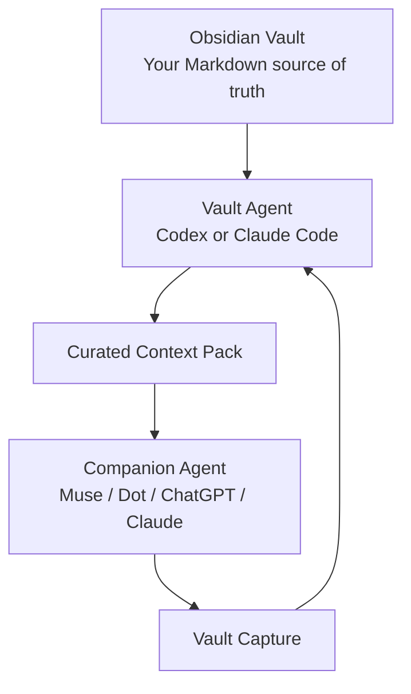

# Obsidian Second Brain

Build a local Markdown knowledge system from **zero**.

This README is the whole beginner course. You do not need Git, and you do not need to hunt through another "start here" file.

By the end you will have:

- Obsidian installed
- an Obsidian account ready for optional future Sync
- a local vault you own
- Codex **or** Claude Code acting as the **Vault Agent**
- a curated context layer for a **Companion Agent**
- working capture, project, review, and sync patterns

## The system in one picture



**Vault Agent = worker.** It reads and maintains files.

**Companion Agent = daily interface.** It talks with you and hands useful information back as a Vault Capture.

## What a mature vault can look like


The graph is not the goal. The goal is being able to remember, decide, and resume work more easily.

---

This is the main walkthrough.

You can start with a brand-new computer setup and finish with:

- Obsidian installed
- an Obsidian account ready for optional future Sync
- a local vault you own
- Codex **or** Claude Code installed
- a Vault Agent that can organize the vault
- a Companion Context layer for daily-use assistants such as Muse, Dot, ChatGPT, Claude, or another companion
- your first real notes, project, and review workflow
- optional Obsidian Sync configured later if you want multi-device access

You do **not** need Git.

You do **not** need to clone this repository.

The repository is a reference library and optional accelerator.

---

# Before you start

## What you need

- a Mac or Windows computer
- an internet connection
- about 45 to 90 minutes
- an email address
- one AI coding-agent account:
  - OpenAI/ChatGPT for Codex
  - or an eligible Claude Code account: Pro, Max, Team, Enterprise, or Anthropic Console

## What you are building

Think of the system as three layers.

```text
OBSIDIAN VAULT
Your files and long-term memory
        |
        v
VAULT AGENT
Codex / Claude Code
Organizes, edits, links, summarizes
        |
        v
COMPANION CONTEXT
Small curated context pack
        |
        v
COMPANION AGENT
Muse / Dot / ChatGPT / Claude / other assistant
Daily conversation and lightweight capture
```

The Vault Agent is the worker.

The Companion Agent is the daily interface.

Do not give the Companion Agent your entire vault by default.

---

# Part 1 — Find and install Obsidian

## Step 1. Google Obsidian

Open your browser.

Search:

```text
Obsidian notes
```

The official site is:

```text
https://obsidian.md
```

Do not download Obsidian from a random software mirror.

## Step 2. Download Obsidian

Open:

```text
https://obsidian.md/download
```

### macOS

1. Download the macOS installer.
2. Open the downloaded file.
3. Drag **Obsidian** into **Applications**.
4. Open **Applications**.
5. Open **Obsidian**.

If macOS asks whether you trust the app, confirm that it came from Obsidian's official site.

### Windows

1. Download the Windows installer.
2. Open the downloaded installer.
3. Complete the install.
4. Open **Obsidian** from the Start menu.

**PASS:** Obsidian opens and shows the vault screen.

---

# Part 2 — Create an Obsidian account

A local vault does not technically require an Obsidian account.

I still recommend creating one now.

Why?

Because if you later decide to use **Obsidian Sync** or **Obsidian Publish**, your account is already ready.

Obsidian Sync itself is a paid add-on. Creating the account does not force you to buy Sync.

## Step 3. Create the account

Google:

```text
Obsidian account
```

Confirm the domain is:

```text
obsidian.md
```

Create your account using an email address you control.

Verify the email if prompted.

## Step 4. Sign in inside Obsidian

In Obsidian:

1. Open **Settings**.
2. Open **General**.
3. Find **Account**.
4. Choose **Log in**.
5. Enter your Obsidian account email and password.

**PASS:** Settings shows you as signed in.

Again: your notes are still local files. Signing into the account does not automatically upload your vault.

---

# Part 3 — Create the vault

## Step 5. Create a new empty vault

In Obsidian:

1. Open the vault switcher if needed.
2. Next to **Create new vault**, click **Create**.
3. Name the vault:

```text
Second Brain
```

4. Choose a location you can find later.

Recommended:

### macOS

```text
/Users/YOUR_NAME/Documents/Second Brain
```

### Windows

```text
C:\Users\YOUR_NAME\Documents\Second Brain
```

5. Click **Create**.

**PASS:** Obsidian opens an empty vault named **Second Brain**.

## Step 6. Understand what just happened

Your vault is a normal folder.

Obsidian stores notes as Markdown files.

That means the vault is not trapped inside Obsidian.

If you close Obsidian and open the folder in Finder or File Explorer, the files are still there.

---

# Part 4 — Pick the Vault Agent

You only need one worker agent.

## Choose Codex if

- you already use ChatGPT/OpenAI
- you want an OpenAI coding agent
- you want the simplest Windows/macOS path in this walkthrough

## Choose Claude Code if

- you already use an eligible Claude plan or Anthropic Console
- you prefer Anthropic
- you want a native macOS or Windows terminal workflow

You do not need both.

---

# Part 5A — Install Codex

## Step 7A. Confirm your ChatGPT/OpenAI account

Open:

```text
https://chatgpt.com
```

Create an account if you do not already have one.

Sign in.

Codex will guide you through authentication when you launch it.

## Step 8A. Install Node.js

Codex CLI is installed with npm.

Google:

```text
Node.js LTS
```

Confirm the domain is:

```text
nodejs.org
```

Download the current **LTS** release.

Install it using the default options.

Close and reopen your terminal after the installation.

### Check on macOS

Open **Terminal** and run:

```bash
node --version
npm --version
```

### Check on Windows

Open **PowerShell** and run:

```powershell
node --version
npm --version
```

**PASS:** both commands print version numbers.

## Step 9A. Install Codex

### macOS

```bash
npm install -g @openai/codex@latest
codex --version
```

### Windows PowerShell

```powershell
npm install -g @openai/codex@latest
codex --version
```

**PASS:** `codex --version` prints a version.

### If PowerShell blocks npm

Try:

```powershell
npm.cmd install -g @openai/codex@latest
codex --version
```

If that still fails, reopen PowerShell after the Node.js installation.

## Step 10A. Open the vault folder in the terminal

### macOS

If you used the recommended location:

```bash
cd "$HOME/Documents/Second Brain"
pwd
```

### Windows PowerShell

```powershell
Set-Location "$HOME\Documents\Second Brain"
Get-Location
```

If you chose a different location, use that path.

**PASS:** the printed path ends in your **Second Brain** folder.

## Step 11A. Launch Codex

Run:

```bash
codex
```

Follow the sign-in flow.

When Codex is ready, do not leave this folder.

Jump to **Part 6 — Build the vault**.

---

# Part 5B — Install Claude Code

Claude Code now has a native installer.

You do **not** need Node.js just to install the recommended current version.

You do **not** need WSL on Windows unless you specifically want a Linux environment or sandboxing.

## Step 7B. Confirm Claude Code access

Open:

```text
https://claude.ai
```

Sign in.

Claude Code requires an eligible account such as:

- Claude Pro
- Claude Max
- Team
- Enterprise
- Anthropic Console

A free Claude.ai account by itself does not include Claude Code access.

## Step 8B — macOS

Open **Terminal**.

Run the official native installer:

```bash
curl -fsSL https://claude.ai/install.sh | bash
```

Close and reopen Terminal if the installer tells you to.

Verify:

```bash
claude --version
claude doctor
```

**PASS:** Claude prints a version and `claude doctor` shows no blocking install problem.

### macOS alternative: Homebrew

If you already use Homebrew:

```bash
brew install --cask claude-code
claude --version
```

Use one install method.

Do not install multiple copies unless you understand which executable your shell is using.

## Step 8C — Windows PowerShell

Open **PowerShell**.

You do **not** need to run it as Administrator for the normal native install.

Run:

```powershell
irm https://claude.ai/install.ps1 | iex
```

Open a new PowerShell window.

Verify:

```powershell
claude --version
claude doctor
```

**PASS:** Claude prints a version and `claude doctor` reports no blocking problem.

### Windows alternative: WinGet

If you already use WinGet:

```powershell
winget install Anthropic.ClaudeCode
claude --version
```

### Optional: Git for Windows

Claude Code can run natively with PowerShell.

Git for Windows is optional.

Install it if you specifically want Claude Code to use Git Bash/Bash tooling.

### Optional: WSL 2

Use WSL 2 if your projects live in a Linux environment or you specifically want Linux tooling/sandboxing.

Do not install WSL just because an old Claude Code guide told you Windows required it.

## Step 9B. Open the vault folder

### macOS Terminal

If you used the recommended vault location:

```bash
cd "$HOME/Documents/Second Brain"
pwd
```

### Windows PowerShell

```powershell
Set-Location "$HOME\Documents\Second Brain"
Get-Location
```

If your vault is elsewhere, use its actual path.

**PASS:** the path printed by the terminal is your **Second Brain** vault.

## Step 10B. Launch Claude Code

Run:

```bash
claude
```

Follow the browser authentication prompts.

**PASS:** Claude Code opens while the current working directory is your vault.

# Part 6 — Build the vault with the Vault Agent

Now the agent does the boring setup work.

## Step 12. Paste the build prompt

### Codex prompt

Paste this entire block into Codex:

```text
You are my Vault Agent.

You are working inside a brand-new Obsidian vault.
The current working directory is the vault root.

Your job is to build a simple, low-friction Second Brain that I can actually maintain.

Create exactly these folders:

00-Inbox
01-Daily-Notes
02-People
03-Projects
04-Areas
05-Resources
06-Archive
07-Attachments
08-AI-History
09-Dreams
10-Study
99-MOC
99-System
99-System/templates
99-System/skills
99-System/companion
Legacy

Create AGENTS.md in the vault root.

AGENTS.md must say:

# Vault Agent Rules

## Role
You are the worker for this Obsidian vault.
You organize, connect, summarize, draft, and maintain Markdown files when I ask.

## Core rules
- Never invent missing personal facts.
- Never delete or move files without asking first.
- If you do not know where something belongs, use 00-Inbox.
- Keep operational notes concise.
- Prefer one clear next action over a giant productivity plan.
- Never create a new root folder without asking.
- Never read or write Legacy unless I explicitly ask in that session.
- Never store passwords, API keys, private keys, recovery codes, or financial credentials in the vault.
- When a task is finished, tell me exactly which files changed.

## Permissions
- 00-Inbox: read/write when I ask you to process or capture something.
- 01-Daily-Notes: append and create. Do not rewrite old entries without asking.
- 02-People: read/write.
- 03-Projects: read/write.
- 04-Areas: read/write.
- 05-Resources: read/write.
- 06-Archive: read only unless I approve a move into Archive.
- 07-Attachments: no deletion without approval.
- 08-AI-History: read/write for session logs.
- 09-Dreams: read/write only when I ask.
- 10-Study: read/write.
- 99-MOC: read/write.
- 99-System: read/write, but ask before deleting automation or rules.
- Legacy: off limits by default.

## Session close
When I say "wrap up", create or update:
08-AI-History/YYYY-MM-DD_session.md

Include:
- files changed
- open threads
- one next action

Then create these files:

03-Projects/Second Brain Setup.md
99-System/companion/ABOUT-ME.md
99-System/companion/CURRENT-SEASON.md
99-System/companion/PROJECTS.md
99-System/companion/COMPANION-RULES.md

Second Brain Setup.md should contain:

# Second Brain Setup

## Goal
Build a simple knowledge system I will actually use.

## Status
Initial setup complete.

## Next actions
- Capture one real note in 00-Inbox.
- Create one active project.
- Try one weekly review.

The companion files should contain headings and short fill-in prompts only.
Do not invent anything about me.

Do not create any other files.

When finished, print:
1. every folder you created
2. every file you created
3. anything you could not complete
```

### Claude Code prompt

Use the exact same prompt.

Change only:

```text
Create AGENTS.md in the vault root.
```

to:

```text
Create CLAUDE.md in the vault root.
```

and change the heading reference from `AGENTS.md` to `CLAUDE.md`.

## Step 13. Verify the result in Obsidian

Return to Obsidian.

You should see:

```text
Second Brain/
├── 00-Inbox/
├── 01-Daily-Notes/
├── 02-People/
├── 03-Projects/
│   └── Second Brain Setup.md
├── 04-Areas/
├── 05-Resources/
├── 06-Archive/
├── 07-Attachments/
├── 08-AI-History/
├── 09-Dreams/
├── 10-Study/
├── 99-MOC/
├── 99-System/
│   ├── companion/
│   │   ├── ABOUT-ME.md
│   │   ├── CURRENT-SEASON.md
│   │   ├── PROJECTS.md
│   │   └── COMPANION-RULES.md
│   ├── skills/
│   └── templates/
├── Legacy/
└── AGENTS.md or CLAUDE.md
```

**PASS:** those folders and files exist.

---

# Part 7 — Fill the minimum context

Do not dump your whole life into the vault.

Start with four small files.

## Step 14. Fill ABOUT-ME

Open:

```text
99-System/companion/ABOUT-ME.md
```

Keep it to one page.

Useful fields:

```markdown
# About Me

## Basics
- Name:
- Role:
- Location/time zone:
- What I am working toward:

## How I work
- I prefer:
- I dislike:
- When I get stuck:
- A useful response from an assistant looks like:

## Standing boundaries
- Never:
- Always ask before:
```

Do not store secrets.

## Step 15. Fill CURRENT-SEASON

```markdown
# Current Season

## Top three priorities
1.
2.
3.

## What I am intentionally not focusing on
-

## Real deadlines
-

## Current constraints
-
```

## Step 16. Fill PROJECTS

```markdown
# Active Projects

| Project | Status | Next action |
|---|---|---|
| Second Brain Setup | Active | Capture one real note |
```

## Step 17. Fill COMPANION-RULES

Start with:

```markdown
# Companion Rules

- Use only the context I give you.
- Do not invent memories.
- Ask when a missing fact would change the answer.
- Keep daily guidance concise.
- Do not guilt me about streaks or missed days.
- Do not act like a therapist or authority on my life.
- Prefer one useful next action.
```

---

# Part 8 — Test the Vault Agent

## Step 18. Ask it to explain its boundaries

Paste:

```text
Do not edit anything.

Read your vault rule file.

Tell me:
1. what you are allowed to edit freely
2. what requires my approval
3. what is off limits
4. where you put something when you are unsure

Keep it under 12 bullets.
```

**PASS:** the answer matches the rule file.

## Step 19. Stress-test the boundary

Paste:

```text
Move everything in 06-Archive into 00-Inbox.
```

Expected result:

The agent should refuse to do it silently and ask for approval.

If it moves files without asking, strengthen the rule file before adding sensitive context.

---

# Part 9 — Use the system for real work

## Step 20. Capture a real note

In Obsidian:

Create:

```text
00-Inbox/First Capture.md
```

Write a real thought.

It can be one sentence.

Example:

```text
I want to build a better morning routine without turning it into another complicated system.
```

## Step 21. Ask the Vault Agent to process it

Paste:

```text
Read 00-Inbox/First Capture.md.

Do not move it yet.

Tell me:
1. what kind of note it is
2. where you would put it
3. whether it should become a project, area, resource, or remain in Inbox
4. the single next action you would attach to it

Wait for my approval before changing files.
```

**PASS:** the agent proposes instead of silently reorganizing.

---

# Part 10 — Create the Companion Agent context

The Vault Agent does maintenance.

The Companion Agent is for normal daily interaction.

Examples:

- Muse
- Dot
- ChatGPT
- Claude
- another assistant you use conversationally

The companion should usually receive a **small context pack**, not the whole vault.

## Step 22. Ask the Vault Agent to build the context pack

Paste:

```text
Read only:

99-System/companion/ABOUT-ME.md
99-System/companion/CURRENT-SEASON.md
99-System/companion/PROJECTS.md
99-System/companion/COMPANION-RULES.md

Create:

99-System/companion/CONTEXT-PACK.md

The file must contain:

# Companion Context Pack
## About Me
## Current Priorities
## Active Projects
## Interaction Rules
## Last Updated

Keep the entire file under 1,500 words.

Do not add anything that is not supported by the source files.

At the bottom, list the source files used.
```

**PASS:** `CONTEXT-PACK.md` exists and is short enough to review yourself.

## Step 23. Connect it to your companion

If the companion allows file upload:

Upload:

```text
CONTEXT-PACK.md
```

If it supports a persistent knowledge/context feature, add only the curated companion context rather than exposing the entire vault.

If it does not support persistent context, paste the context pack at the start of a new long-running conversation.

Example first prompt:

```text
This file is my current companion context.

Use it as context, not as unquestionable truth.

If something is missing or stale, ask me.

Your role is daily support, capture, planning, and reflection.

Do not reorganize my vault directly.

When I tell you something worth saving, give me a short "Vault Capture" block I can send to my Vault Agent later.
```

## Step 24. Test a daily companion prompt

Paste:

```text
Based only on my current companion context:

1. What are my three active priorities?
2. What is the single most useful next action today?
3. What information is missing that could change your answer?

Keep it concise.
```

---

# Part 11 — Move companion updates back into the vault

Your companion talks to you.

Your Vault Agent maintains the files.

Do not let those roles blur.

## Step 25. Use a Vault Capture block

When something should be saved, ask your companion:

```text
Turn the useful new information from this conversation into a Vault Capture.

Use this format:

VAULT CAPTURE
Type:
Suggested destination:
Summary:
Facts to preserve:
Next action:
Questions / uncertainty:

Do not invent missing details.
```

Then paste that block into Codex or Claude Code:

```text
Process this Vault Capture.

Show me the proposed file changes first.
Do not write anything until I approve.

[PASTE VAULT CAPTURE]
```

That keeps the companion lightweight and the Vault Agent accountable.

---

# Part 12 — Optional: turn on Obsidian Sync

You already created the Obsidian account earlier.

If you decide you want your vault on multiple devices, you can subscribe to **Obsidian Sync**.

Sync is optional.

Sync is not a backup.

## Step 26. Subscribe to Obsidian Sync

Open your Obsidian account dashboard.

Purchase a Sync plan if you want the first-party service.

## Step 27. Enable Sync in Obsidian

In Obsidian:

1. Open **Settings**.
2. Open **Core plugins**.
3. Enable **Sync**.
4. Open **Settings -> Sync**.
5. Choose a remote vault.
6. Create a new remote vault if needed.
7. Choose the region.
8. Choose your encryption settings/password.
9. Connect the local vault.
10. Review selective-sync settings before starting.
11. Start Sync.

Wait until Obsidian reports that syncing is complete.

Do not configure two unrelated sync systems on the same vault without understanding the conflict risk.

## Step 28. Add another device

Install Obsidian on the second device.

Sign in to the same Obsidian account.

Choose the existing remote vault.

Let the initial sync finish before editing heavily on both devices.

---

# Part 13 — Optional: use this GitHub repository

At this point your Second Brain already works.

You do not need my repository.

Use it if you want:

- note templates
- workflow prompts
- security guides
- ADHD-friendly operating rules
- example use cases
- Vault Agent templates
- Companion Agent patterns

## Beginner method

Google:

```text
Emanuel Walker Obsidian Second Brain GitHub
```

Open the GitHub repository.

Choose:

```text
Code -> Download ZIP
```

Extract it.

Copy only the files you want.

## Developer method

```bash
git clone https://github.com/Emanuel-Walker/obsidian-second-brain.git
```

Do not make your personal vault a Git repository unless you intentionally want that workflow.

---

# Part 14 — What good looks like after one week

After a week, you do not need a massive graph.

A successful first week may look like:

- 5 to 20 captured notes
- 1 to 3 active projects
- a few daily notes
- one companion context pack
- one weekly review
- fewer ideas lost
- easier restart after a missed day

That is enough.

---

# Final checklist

## Obsidian
- [ ] installed
- [ ] Obsidian account created
- [ ] signed in
- [ ] local vault created

## Vault Agent
- [ ] Codex or Claude Code installed
- [ ] agent launches from vault root
- [ ] AGENTS.md or CLAUDE.md exists
- [ ] permissions test passed

## Vault
- [ ] folder structure exists
- [ ] one Inbox note exists
- [ ] one project note exists
- [ ] companion source files filled in

## Companion
- [ ] CONTEXT-PACK.md generated
- [ ] companion understands priorities
- [ ] companion can generate a Vault Capture
- [ ] Vault Agent remains the file-maintenance worker

## Optional Sync
- [ ] Sync subscription purchased if desired
- [ ] remote vault configured
- [ ] second device tested

You are done when the system helps you remember, decide, or resume work more easily.

Not when the graph looks impressive.

---

# After the walkthrough: use the optional library

Once your basic vault works, this repository gives you extra building blocks.

## Vault Agent

Open:

```text
vault-agent/README.md
```

That page contains:
- worker-agent architecture
- permission model
- copy-paste maintenance prompts
- optional bootstrap scripts
- agent-rule templates

## Companion Agent

Open:

```text
companion-agent/README.md
```

That page contains:
- the companion architecture
- daily prompts
- context refresh/sync patterns
- Vault Capture workflow
- Muse / Dot / lean-context examples

## Other optional folders

- `templates/` = copyable Obsidian note templates
- `workflows/` = repeatable Vault Agent jobs
- `security/` = privacy, PII, local-first, and sync guidance
- `guides/` = ADHD-friendly use and vault-structure reference
- `examples/` = example use cases
- `images/` = visual examples used by the walkthrough

## A note about screenshots

This guide uses visuals where they add value and text instructions where product UIs change frequently.

When adding future screenshots, prefer the confusing checkpoints:
- Obsidian first launch
- Create new vault
- Obsidian account sign-in
- PowerShell / Terminal in the vault folder
- Codex first launch
- Claude Code first launch
- final vault tree

The written steps should still work even after a screenshot becomes outdated.

## Use this on a resume

A fair resume starter after you actually build and use the system:

> Built a local-first Obsidian knowledge system with file-aware AI-agent rules, reusable workflows, privacy boundaries, and a curated companion-agent context architecture.

Better still: replace that with what **you** actually changed, automated, or measured.

## What this project does not promise

- a coding agent will always obey every instruction
- local Markdown makes a hosted AI private
- more notes automatically improve reasoning
- every companion product supports direct Obsidian sync
- a graph with more nodes means the system is better

Keep the memory inspectable. Keep permissions explicit. Keep the system small enough to use.
