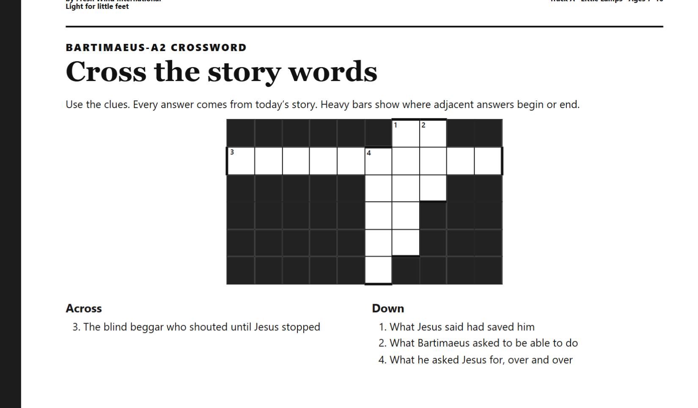
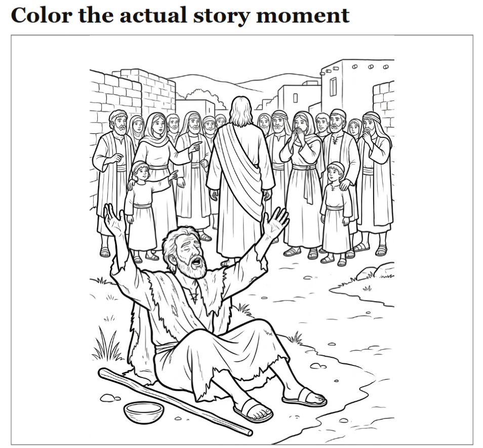

# Example - Generating Study Materials in Your Vault

**The point:** your vault plus an agent can generate domain-specific study materials on demand. This example uses a children's lesson pack as the domain. Swap in whatever your actual domain is: security training handouts, team onboarding worksheets, language flashcards, whatever.

The two sample images below were generated inside Obsidian for a kids program. The header on the originals came from a church publication and has been generalized for this template. Treat these as output examples. Your domain, your content.

---

## The pattern

1. You keep source material in `05-Resources/` or `10-Study/`. In this example, a set of short lesson summaries.
2. You ask the agent to generate a worksheet, a crossword, or a coloring page from a specific lesson.
3. The agent writes a markdown draft with embedded instructions for your preferred image or PDF generator.
4. You render to a shareable PDF with pandoc or a plugin.

---

## Worksheet sample



_This is a crossword activity for a kids study program. It was generated from a short lesson stored in the vault. Swap in your own domain and the same workflow produces security quiz worksheets, language drills, or team onboarding handouts._

---

## Coloring page sample



_A coloring page tied to the same lesson. The agent produced a text prompt for the image generator and a caption for the page. Again, the domain is swappable. The workflow is the point._

---

## The actual recipe

```
I am building a lesson pack for kids on <topic>. The source material lives at
10-Study/<topic>/lesson-N.md.

Generate:
1. A one-page kid-friendly worksheet. 6 questions, mixed fill-in-blank and multiple choice.
2. A crossword with 8 clues drawn from the lesson vocabulary.
3. A caption and a short image prompt for a coloring page.

Save to 00-Outbound/<topic>/lesson-N-worksheet.md and lesson-N-crossword.md.
Keep the reading level at 2nd grade.
```

The agent writes the markdown. You review. Then render to PDF:

```bash
pandoc 00-Outbound/<topic>/lesson-N-worksheet.md -o lesson-N-worksheet.pdf
```

---

## Why this matters

The vault compounds. One lesson is nice. Fifty lessons with associated worksheets is a curriculum. The agent does the formatting work. You keep the editorial control. Three months in, you have a library you could ship.

<!-- Source: github.com/Emanuel-Walker/obsidian-second-brain -->
---
_Part of the obsidian-second-brain template. [Fork on GitHub](https://github.com/Emanuel-Walker/obsidian-second-brain). Credit appreciated, not required._
