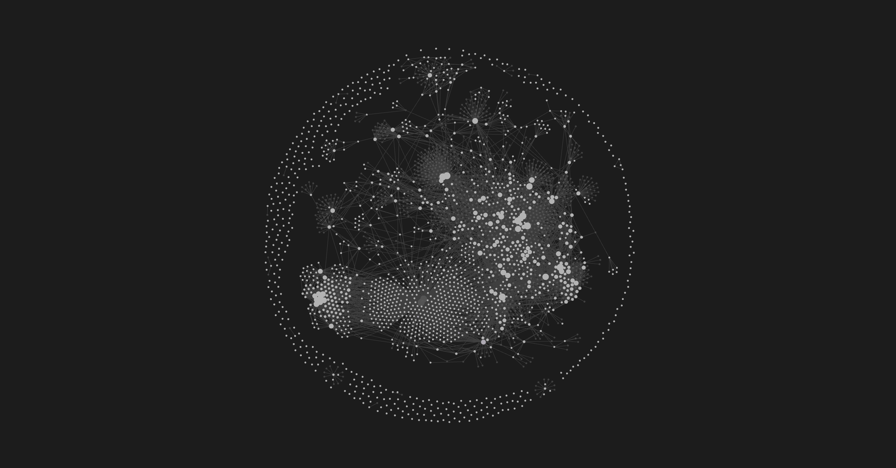

# Example - Knowledge Graph Growth

**The point:** the graph view is a receipt. It shows that you have been thinking. Dense clusters are the topics you actually work on. Sparse areas are the ones you say you care about but never write down. Look at the graph monthly and you will catch yourself.

---

## The hero shot



_This vault had about six months of daily use with an agent helping maintain the links. Every node is a note. Every edge is a `[[wikilink]]`. The dense clusters near the center are the active projects and the people most involved. The outer satellites are reference material, resources, and ideas that have not yet connected back to anything._

---

## How the graph grows

Three habits grow the graph more than anything else:

1. **Daily notes with linked people and projects.** Even one or two wikilinks per daily note compounds over a year.
2. **Person notes.** The moment someone is mentioned in three different notes, their person note becomes the hub for everything they touch.
3. **Project index notes.** Every project folder has a `00_Index.md` that links to the files inside and to related projects. The index node becomes a magnet for everything in that domain.

The agent does most of the work. When you write a daily note that mentions a person or a project, the agent adds the wikilink if you forgot. Over months, this is the difference between a vault with 50 edges and a vault with 5,000.

---

## What a healthy graph looks like

- A few dense clusters around active work.
- Hub nodes where people, projects, and MOCs sit.
- A long tail of satellite notes that connect in slowly over time.
- Few orphan nodes.

Orphans are notes that nobody links to. Some orphans are fine. Daily notes stay orphan on purpose. Reference notes that live in `05-Resources/` are usually orphan until you cite them from a project. But a project note that is an orphan after a week is a signal. Either link it in or archive it.

---

## Monthly graph review

Once a month, open the graph view. Spend five minutes looking.

Three questions:

1. Which cluster is biggest? Is that the thing I say is my priority?
2. Which cluster shrank this month? Did I abandon that topic on purpose?
3. Which orphan notes should I either link in or move to Archive?

Then ask the agent:

```
List the 20 most-linked notes in the vault. List the 20 orphan notes created
in the last 30 days. Propose which orphans should be linked and to what.
```

Review the proposals. Approve the ones that make sense. The graph tightens.

---

## The deeper point

The graph is not for showing off. It is a mirror of what you actually spent your attention on. Pretty graphs are a side effect. Catching the gap between what you said you cared about and what you actually wrote down is the real win.

<!-- Source: github.com/Emanuel-Walker/obsidian-second-brain -->
---
_Part of the obsidian-second-brain template. [Fork on GitHub](https://github.com/Emanuel-Walker/obsidian-second-brain). Credit appreciated, not required._
